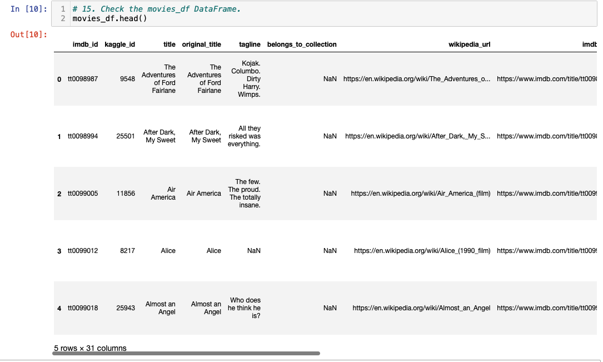
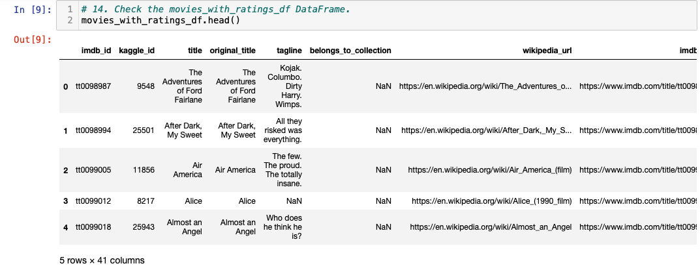
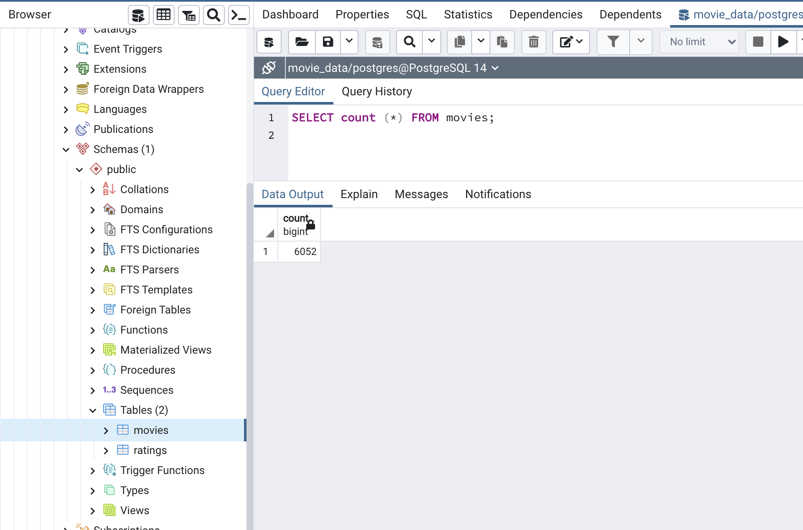
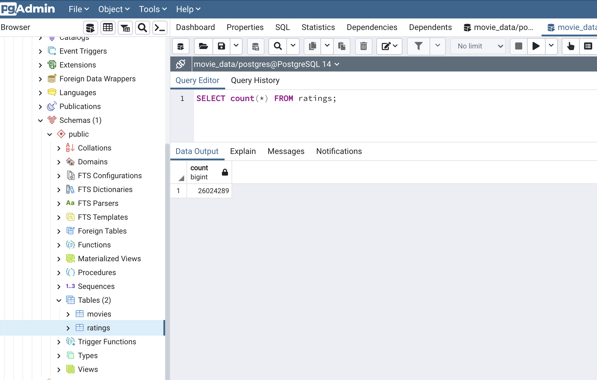

# Movies-ETL

## Overview of the Project 

### Purpose 
 
Performing ETL process for the Amazon Prime video by extracing the data from json file and csv files, transforming into the datasets by cleaning and joining them together, finally loading the cleaned data to the SQL database.

The datas were stored in wikipedia_movies.json, movies_metadata.csv and ratings.csv. 

### Initial analysis 

The initial analysis were made for the 3 files in 3 steps :Extract,Transform and Load  

•Extraction:

After downloading, we extracted the .json and .csv files for movies into Pandas dataFrame and performed the exploratory data analysis using jupyter notebook. 
  
•Clean and Transform:

Performed the cleaning process on 3 newly created dataframes by creating functions to clean the data, convert and parse the data by using regular expression and finally merging wiki_movies_df ,movies_metadata_df and ratings_df. 

•Load:

Created database engine to import clean movies data and ratings data into the PostgreSQL.

[ETL-Movies.ipynb](ETL-Movies.ipynb) - Initial analysis on Movies data.

### Updated Analysis

Main purpose of the updated analysis is to create an automated pipeline that takes in new data, performs the transformations to clean the data and loads the data into existing tables.By taking code that was previously created during inital analysis,we refactored into one function that takes in the three files—Wikipedia data, Kaggle metadata, and the MovieLens rating data—and performs the ETL process to add the data into the PostgreSQL database.

movies_df 

 
movies_with_ratings_df

movies tables   

ratings table

Below are the files for the Updated analysis on Movies data. 

[ETL_function_test.ipynb](ETL_function_test.ipynb)

[ETL_clean_wiki_movies.ipynb](ETL_clean_wiki_movies.ipynb)

[ETL_clean_kaggle_data.ipynb](ETL_clean_kaggle_data.ipynb)

[ETL_create_database.ipynb](ETL_create_database.ipynb)

